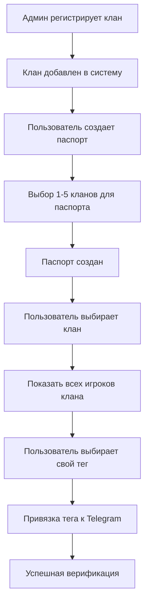

# План системы паспортов для NewPyBot Clash of Clans v1.2.2

## 📋 Обзор системы

Система паспортов - это комплексное решение для привязки игровых аккаунтов Clash of Clans к профилям Telegram, обеспечивающее верификацию игроков и расширенную функциональность бота.

---

## 🎯 Основные цели

### Первичные цели
# Проверяем текущий статус
git status

# Добавляем файл с планом системы паспортов
git add docs/PASSPORT_SYSTEM_PLAN.md

# Первый коммит - базовая структура системы паспортов
git commit -m "feat: добавлена базовая архитектура системы паспортов

- Создана структура регистрации кланов администраторами
- Добавлена система паспортов с поддержкой 1-5 кланов
- Реализован процесс привязки через выбор игрока из списка
- Определена схема базы данных для паспортов и привязок"

# Второй коммит - персональная статистика
git add docs/PASSPORT_SYSTEM_PLAN.md
git commit -m "feat: добавлена персональная статистика игроков

- Профиль игрока: ТХ, опыт, роль в клане, базовая информация
- Статистика кубков: текущие, лучшие, Builder Base, тренды
- Лиги: текущая лига, история, прогресс по сезонам
- Рейды: Capital Hall, атаки, урон, вклад в клан
- Команды: /my_profile, /my_stats, /my_achievements, /compare"

# Третий коммит - система уведомлений
git add docs/PASSPORT_SYSTEM_PLAN.md
git commit -m "feat: добавлена система уведомлений для владельцев паспортов

- Военные уведомления: напоминания об атаках, результаты войн
- Capital Raids: уведомления о рейдах и результатах
- Достижения: новые рекорды, изменения лиг, топ клана
- Периодические отчеты: еженедельная и месячная аналитика
- Автоматические cron задачи для мониторинга событий"

# Четвертый коммит - техническая реализация и план внедрения
git add docs/PASSPORT_SYSTEM_PLAN.md
git commit -m "docs: добавлен план внедрения и техническая документация

- 8-фазный план разработки (7-12 недель)
- Техническая архитектура с примерами кода
- API endpoints и команды бота
- Метрики успеха и KPI системы
- Временные рамки и приоритеты задач"

# Пушим все коммиты в репозиторий
git push origin main- ✅ Обеспечить простую привязку игровых аккаунтов к Telegram через выбор клана
- ✅ Дать администраторам контроль над регистрацией кланов в системе
- ✅ Предоставить гибкую систему выбора из 1-5 кланов в паспорте
- ✅ Упростить процесс верификации через показ списка игроков клана

### Вторичные цели
- 📊 Создать систему рейтингов и топов среди верифицированных игроков
- 🏆 Повысить вовлеченность пользователей через геймификацию
- 📈 Улучшить аналитические возможности для администраторов кланов  
- 🔒 Обеспечить контролируемый доступ к системе через админскую регистрацию кланов

---

## 🏗️ Архитектура системы

### Основные компоненты

#### 1. Core Module (Ядро системы)
```
passport_system/
├── core/
│   ├── passport_manager.py      # Основной менеджер паспортов
│   ├── verification.py          # Система верификации
│   └── exceptions.py            # Кастомные исключения
├── models/
│   ├── passport.py             # Модель паспорта пользователя
│   └── verification_log.py     # Логи верификации
├── services/
│   ├── ranking_service.py      # Система рейтингов
│   ├── stats_service.py        # Сервис расширенной статистики
│   └── notification_service.py # Уведомления
└── utils/
    ├── formatters.py           # Форматирование сообщений
    └── validators.py           # Валидация данных
```

#### 2. Database Schema (Схема БД)
```sql
-- Таблица зарегистрированных кланов (регистрируют админы)
CREATE TABLE registered_clans (
    id SERIAL PRIMARY KEY,
    clan_tag VARCHAR(15) NOT NULL UNIQUE, -- Тег клана (#ABC123DEF)
    clan_name VARCHAR(100) NOT NULL,      -- Название клана
    registered_by BIGINT NOT NULL,        -- ID админа, который зарегистрировал
    registered_at TIMESTAMP DEFAULT NOW(), -- Время регистрации
    is_active BOOLEAN DEFAULT TRUE,       -- Активность клана в системе
    last_updated TIMESTAMP DEFAULT NOW(), -- Последнее обновление данных клана
    
    INDEX idx_clan_tag (clan_tag),
    INDEX idx_registered_by (registered_by)
);

-- Настройки кланов для чатов (система контекстного выбора)
CREATE TABLE chat_clan_settings (
    id SERIAL PRIMARY KEY,
    chat_id BIGINT NOT NULL,
    registered_clan_id INTEGER NOT NULL,  -- ID из registered_clans
    clan_number INTEGER NOT NULL,         -- Номер клана в чате (1, 2, 3...)
    is_default BOOLEAN DEFAULT FALSE,     -- Основной клан чата
    display_name VARCHAR(100),            -- Альтернативное название для отображения
    added_at TIMESTAMP DEFAULT NOW(),
    added_by BIGINT NOT NULL,            -- Кто добавил клан в чат
    
    UNIQUE(chat_id, clan_number),        -- Уникальные номера в чате
    UNIQUE(chat_id, registered_clan_id), -- Клан не может быть дважды в одном чате
    FOREIGN KEY (registered_clan_id) REFERENCES registered_clans(id) ON DELETE CASCADE,
    INDEX idx_chat_clans (chat_id, clan_number),
    INDEX idx_default_clan (chat_id, is_default)
);

-- Таблица паспортов пользователей
CREATE TABLE user_passports (
    id SERIAL PRIMARY KEY,
    user_id BIGINT NOT NULL UNIQUE,       -- Telegram User ID (один паспорт на пользователя)
    created_at TIMESTAMP DEFAULT NOW(),
    updated_at TIMESTAMP DEFAULT NOW(),
    
    INDEX idx_user_id (user_id)
);

-- Таблица доступных кланов в паспорте (1-5 кланов)
CREATE TABLE passport_clans (
    id SERIAL PRIMARY KEY,
    passport_id INTEGER REFERENCES user_passports(id) ON DELETE CASCADE,
    clan_id INTEGER REFERENCES registered_clans(id) ON DELETE CASCADE,
    added_at TIMESTAMP DEFAULT NOW(),
    
    UNIQUE(passport_id, clan_id),         -- Один клан не может быть дважды в паспорте
    INDEX idx_passport_id (passport_id),
    INDEX idx_clan_id (clan_id)
);

-- Таблица привязанных игроков (связь user -> player_tag)
CREATE TABLE user_player_bindings (
    id SERIAL PRIMARY KEY,
    user_id BIGINT NOT NULL,              -- Telegram User ID
    player_tag VARCHAR(15) NOT NULL,       -- Игровой тег (#ABC123DEF)
    clan_tag VARCHAR(15) NOT NULL,        -- Тег клана, через который привязался
    bound_at TIMESTAMP DEFAULT NOW(),     -- Время привязки
    is_active BOOLEAN DEFAULT TRUE,       -- Активность привязки
    
    UNIQUE(player_tag),                   -- Один игрок = одна привязка
    FOREIGN KEY (clan_tag) REFERENCES registered_clans(clan_tag),
    INDEX idx_user_id (user_id),
    INDEX idx_player_tag (player_tag),
    INDEX idx_clan_tag (clan_tag)
);

-- Таблица логов действий с паспортами
CREATE TABLE passport_logs (
    id SERIAL PRIMARY KEY,
    user_id BIGINT NOT NULL,              -- Пользователь, с которым произошло действие
    action VARCHAR(50) NOT NULL,          -- Тип действия
    details JSON,                         -- Детали действия
    performed_by BIGINT,                  -- Кто выполнил действие (админ/система)
    created_at TIMESTAMP DEFAULT NOW(),
    
    INDEX idx_user_id (user_id),
    INDEX idx_action (action)
);

-- Кеш статистики игроков
CREATE TABLE player_stats_cache (
    player_tag VARCHAR(15) PRIMARY KEY,
    stats_data JSON NOT NULL,            -- Кешированная статистика
    last_updated TIMESTAMP DEFAULT NOW(),
    expires_at TIMESTAMP NOT NULL,
    
    INDEX idx_expires_at (expires_at)
);

-- История изменений статистики игроков
CREATE TABLE player_stats_history (
    id SERIAL PRIMARY KEY,
    player_tag VARCHAR(15) NOT NULL,
    stat_type VARCHAR(50) NOT NULL,      -- 'trophies', 'league', 'donations', 'war_stars', 'capital'
    old_value JSON,                      -- Старое значение
    new_value JSON,                      -- Новое значение
    change_date TIMESTAMP DEFAULT NOW(),
    
    INDEX idx_player_tag (player_tag),
    INDEX idx_stat_type (stat_type),
    INDEX idx_change_date (change_date)
);

-- Снапшоты ежедневной статистики
CREATE TABLE daily_player_snapshots (
    id SERIAL PRIMARY KEY,
    player_tag VARCHAR(15) NOT NULL,
    snapshot_date DATE NOT NULL,
    trophies INTEGER,
    league_id INTEGER,
    league_name VARCHAR(100),
    donations INTEGER,
    donations_received INTEGER,
    war_stars INTEGER,
    attack_wins INTEGER,
    defense_wins INTEGER,
    capital_gold INTEGER DEFAULT 0,
    
    UNIQUE(player_tag, snapshot_date),
    INDEX idx_player_tag (player_tag),
    INDEX idx_snapshot_date (snapshot_date)
);

-- Лог уведомлений
CREATE TABLE notification_log (
    id SERIAL PRIMARY KEY,
    user_id BIGINT NOT NULL,              -- Telegram User ID
    notification_type VARCHAR(50) NOT NULL, -- Тип уведомления
    message_text TEXT,                    -- Текст отправленного сообщения
    sent_at TIMESTAMP DEFAULT NOW(),     -- Время отправки
    is_read BOOLEAN DEFAULT FALSE,       -- Прочитано ли (для будущих функций)
    
    INDEX idx_user_id (user_id),
    INDEX idx_notification_type (notification_type),
    INDEX idx_sent_at (sent_at)
);

-- Настройки уведомлений пользователей
CREATE TABLE user_notification_settings (
    user_id BIGINT PRIMARY KEY,          -- Telegram User ID
    war_reminders BOOLEAN DEFAULT TRUE,  -- Напоминания о войнах
    capital_reminders BOOLEAN DEFAULT TRUE, -- Напоминания о рейдах
    achievement_notifications BOOLEAN DEFAULT TRUE, -- Уведомления о достижениях
    weekly_reports BOOLEAN DEFAULT TRUE, -- Еженедельные отчеты
    league_changes BOOLEAN DEFAULT TRUE, -- Изменения лиг
    donation_reminders BOOLEAN DEFAULT TRUE, -- Напоминания о донатах
    created_at TIMESTAMP DEFAULT NOW(),
    updated_at TIMESTAMP DEFAULT NOW(),
    
    FOREIGN KEY (user_id) REFERENCES user_passports(user_id) ON DELETE CASCADE
);

-- Система достижений (эксклюзивно для владельцев паспортов)
CREATE TABLE achievements (
    id SERIAL PRIMARY KEY,
    achievement_key VARCHAR(50) NOT NULL UNIQUE, -- 'novice', 'activist', 'veteran', 'legend', etc.
    category VARCHAR(30) NOT NULL,               -- 'activity', 'quality', 'social', 'game', 'special'
    title VARCHAR(100) NOT NULL,                 -- Название достижения
    description TEXT,                            -- Описание критериев
    icon VARCHAR(10) DEFAULT '🏆',               -- Эмодзи иконка
    color VARCHAR(20) DEFAULT 'gold',           -- Цвет (bronze, silver, gold, platinum, diamond)
    requirement_type VARCHAR(30) NOT NULL,      -- 'messages_count', 'help_count', 'social_score', etc.
    requirement_value INTEGER NOT NULL,         -- Пороговое значение
    points INTEGER DEFAULT 0,                   -- Баллы за получение
    is_active BOOLEAN DEFAULT TRUE,             -- Активность достижения
    created_at TIMESTAMP DEFAULT NOW(),
    
    INDEX idx_category (category),
    INDEX idx_requirement (requirement_type, requirement_value)
);

-- Полученные достижения пользователей (только для владельцев паспортов)
CREATE TABLE user_achievements (
    id SERIAL PRIMARY KEY,
    user_id BIGINT NOT NULL,                    -- Telegram User ID (должен иметь паспорт)
    achievement_id INTEGER NOT NULL,            -- ID достижения
    earned_at TIMESTAMP DEFAULT NOW(),         -- Время получения
    progress_value INTEGER DEFAULT 0,          -- Значение при получении
    notified BOOLEAN DEFAULT FALSE,            -- Уведомлен ли пользователь
    
    UNIQUE(user_id, achievement_id),           -- Одно достижение один раз
    FOREIGN KEY (user_id) REFERENCES user_passports(user_id) ON DELETE CASCADE,
    FOREIGN KEY (achievement_id) REFERENCES achievements(id) ON DELETE CASCADE,
    INDEX idx_user_achievements (user_id, earned_at DESC),
    INDEX idx_achievement_users (achievement_id, earned_at DESC)
);

-- Прогресс пользователей к достижениям
CREATE TABLE achievement_progress (
    id SERIAL PRIMARY KEY,
    user_id BIGINT NOT NULL,                   -- Telegram User ID  
    achievement_id INTEGER NOT NULL,           -- ID достижения
    current_value INTEGER DEFAULT 0,          -- Текущее значение
    last_updated TIMESTAMP DEFAULT NOW(),     -- Последнее обновление
    
    UNIQUE(user_id, achievement_id),
    FOREIGN KEY (user_id) REFERENCES user_passports(user_id) ON DELETE CASCADE,
    FOREIGN KEY (achievement_id) REFERENCES achievements(id) ON DELETE CASCADE,
    INDEX idx_user_progress (user_id),
    INDEX idx_progress_value (achievement_id, current_value DESC)
);

-- Статистика активности пользователей для достижений
CREATE TABLE user_activity_stats (
    user_id BIGINT PRIMARY KEY,               -- Telegram User ID
    
    -- Активность в чате
    total_messages INTEGER DEFAULT 0,         -- Общее количество сообщений
    quality_messages INTEGER DEFAULT 0,      -- Качественные сообщения 
    helpful_messages INTEGER DEFAULT 0,      -- Помощи новичкам
    social_interactions INTEGER DEFAULT 0,   -- Социальные взаимодействия
    
    -- Игровые достижения
    clash_commands_used INTEGER DEFAULT 0,   -- Использование команд бота
    strategies_shared INTEGER DEFAULT 0,     -- Поделился стратегиями
    wars_participated INTEGER DEFAULT 0,     -- Участие в войнах клана
    
    -- Социальная активность
    replies_given INTEGER DEFAULT 0,         -- Ответов дано
    mentions_received INTEGER DEFAULT 0,     -- Упоминаний получено
    reactions_received INTEGER DEFAULT 0,    -- Реакций получено
    newbie_helps INTEGER DEFAULT 0,          -- Помощей новичкам
    
    -- Временные метрики
    days_active INTEGER DEFAULT 0,           -- Дней активности
    consecutive_days INTEGER DEFAULT 0,      -- Дней подряд активен
    first_activity DATE,                     -- Первая активность
    last_activity DATE,                      -- Последняя активность
    
    -- Индексы качества
    helpfulness_score DECIMAL(5,2) DEFAULT 0, -- Индекс полезности
    social_score DECIMAL(5,2) DEFAULT 0,      -- Социальный индекс
    leadership_score DECIMAL(5,2) DEFAULT 0,  -- Индекс лидерства
    
    updated_at TIMESTAMP DEFAULT NOW(),
    
    FOREIGN KEY (user_id) REFERENCES user_passports(user_id) ON DELETE CASCADE,
    INDEX idx_total_messages (total_messages DESC),
    INDEX idx_quality_messages (quality_messages DESC),
    INDEX idx_social_score (social_score DESC)
);
```

---

## 🔧 Функциональные возможности

### 1. Система паспортов и привязки

#### Процесс работы с паспортами:

**Этап 1: Регистрация кланов администраторами**
- Админы добавляют кланы в систему через команду бота
- Система автоматически получает информацию о клане через API
- Кланы становятся доступными для добавления в паспорта

**Этап 2: Создание паспорта пользователем**
- Пользователь создает паспорт 
- Выбирает от 1 до 5 зарегистрированных кланов
- Кланы добавляются в его паспорт для дальнейшего выбора

**Этап 3: Привязка игрового аккаунта**
- Пользователь выбирает клан из своего паспорта
- Система показывает всех игроков выбранного клана
- Пользователь выбирает свой игровой тег из списка
- Происходит привязка тега к аккаунту Telegram

#### Схема процесса:


#### Команды бота:

**Для администраторов:**
- `/register_clan <тег_клана>` - Зарегистрировать клан в системе
- `/unregister_clan <тег_клана>` - Удалить клан из системы
- `/clan_list` - Показать все зарегистрированные кланы
- `/add_clan_to_chat <тег_клана>` - Добавить зарегистрированный клан в чат
- `/set_default_clan <номер>` - Установить основной клан чата

**Для пользователей:**
- `/create_passport` - Создать паспорт
- `/add_clan <тег_клана>` - Добавить клан в паспорт (до 5 кланов)
- `/remove_clan <тег_клана>` - Удалить клан из паспорта
- `/bind_player` - Начать процесс привязки игрока
- `/my_passport` - Показать информацию о паспорте
- `/clans` - Показать все кланы чата с номерами

**Персональная статистика и достижения:**
- `/my_profile` - Полный профиль игрока (общая информация, кубки, лиги, рейды + ачивки)
- `/my_stats` - Детальная статистика и аналитика
- `/my_achievements` - Все достижения и прогресс (эксклюзивно для паспортов!)
- `/my_history` - История изменений (кубки, лиги, донаты)
- `/progress [период]` - Прогресс за день/неделю/месяц
- `/compare <тег_игрока>` - Сравнение с другим игроком
- `/achievement_progress <название>` - Прогресс к конкретному достижению
- `/top_achievements [категория]` - Топ по достижениям среди владельцев паспортов

**Клановая статистика с контекстным выбором:**
- `/wars [номер]` - Статистика войн (авто-выбор клана пользователя или указанный номер)
- `/raids [номер]` - Capital Raids статистика  
- `/members [номер]` - Участники клана
- `/donations [номер]` - Статистика донатов клана
- `/clan_stats [номер]` - Общая статистика клана

**Система уведомлений:**
- `/notifications` - Настройки уведомлений (включить/отключить типы)
- `/notifications_log` - История полученных уведомлений
- `/test_notification` - Тестовое уведомление (для проверки работы)
- `/weekly_report` - Получить еженедельный отчет прямо сейчас

### 2. Персональная статистика игроков

#### Общий профиль игрока:
Система паспортов предоставляет детальную информацию о верифицированном игроке:

**Базовая информация:**
- 👤 Имя игрока и тег
- 🏠 Уровень Town Hall (ТХ)
- ⭐ Уровень опыта
- 👑 Роль в клане
- 🎖️ Достижения и медали

**Боевая статистика:**
- ⚔️ Атаки: победы/поражения
- 🛡️ Защиты: успешные отражения
- 💥 Звезды войн (общее количество)
- 🎯 Процент разрушения в атаках

#### Система кубков (кв.):
**Текущие показатели:**
- 🏆 Текущие кубки
- 🥇 Лучший результат за все время
- 📊 Изменение за последние 7 дней
- 📈 Тренд: рост/падение

**Builder Base кубки:**
- 🏗️ Кубки Builder Base
- 🥇 Лучший результат BB
- 🆚 Побед в битвах против

#### Лиги и рейтинги (лвк.):
**Текущая лига:**
- 🏅 Название лиги (Bronze, Silver, Gold, Crystal, Master, Champion, Titan, Legend)
- 🎖️ Иконка лиги
- 📊 Position in league (если Legend League)

**Статистика лиг:**
- 🚀 Максимальная достигнутая лига
- 📅 История изменения лиг по сезонам
- 🏆 Количество сезонов в топовых лигах

#### Рейды (Capital Raids):
**Статистика рейдов:**
- 🏛️ Уровень Capital Hall в клане
- ⚔️ Атаки в рейдах: использованные/доступные
- 💰 Capital Gold заработанный
- 🎯 Средний урон за атаку в рейдах
- 📊 Вклад в клановые рейды (% от общего урона)

**Рейдовые достижения:**
- 🥇 Лучшая атака в рейде (урон)
- 🏆 Рейды завершенные как лучший атакующий
- 📈 Прогресс разрушения вражеских столиц

#### Визуальная индикация верификации:

**Форматирование в сообщениях:**
- **Обычный игрок**: `Player Name`
- **Верифицированный игрок**: `**Player Name** ✅`
- **VIP игрок**: `**Player Name** 👑`
- **Модератор/Админ**: `**Player Name** ⭐`

**Дополнительные индикаторы:**
- 🏆 - Топ игрок по кубкам
- 🎁 - Топ донатер
- ⚔️ - Активный участник войн
- 🛡️ - Лучший защитник
- 🏛️ - Активный в рейдах
- 📈 - Растущий игрок

### 3. Система уведомлений для владельцев паспортов

#### Типы уведомлений:

**⚔️ Уведомления о войнах:**
- Забыли сделать атаку в войне клана (за 4 часа до окончания)
- Началась новая война клана
- Результаты войны (победа/поражение)
- Лучшая защита/атака в войне

**🏛️ Уведомления о рейдах Capital:**
- Забыли сделать атаки в рейде (за 12 часов до окончания)
- Начался новый рейд выходных
- Результаты рейда клана
- Достигнут новый рекорд урона в рейде

**🏆 Уведомления о достижениях:**
- Изменение лиги (повышение/понижение)
- Новый личный рекорд кубков
- Завершение достижения
- Попадание в топ клана по какой-либо категории

**🎁 Социальные уведомления:**
- Превышение лимита полученных донатов без отдачи
- Достижение значимых вех в донатах (10k, 25k, 50k+)
- Изменение роли в клане
- Долгое отсутствие активности (неделя без входа)

**📊 Периодические отчеты:**
- Еженедельная сводка прогресса
- Ежемесячный отчет по статистике
- Сравнение с прошлым периодом

#### Примеры уведомлений:

```
⚔️ **Война клана!**
Привет, **PlayerName** ✅!

⏰ До окончания войны осталось 3 часа 45 минут
🎯 У вас есть неиспользованные атаки: 1/2

Ваша цель: #5 EnemyPlayer (ТХ14)
💡 Рекомендуемая стратегия: Dragons + Loons

Не упустите шанс помочь клану! 💪
```

```
🏆 **Новое достижение!**
Поздравляем, **PlayerName** ✅!

🎉 Получено достижение: ⭐ **Помощник**
📋 Описание: 50 полезных ответов новичкам
🎯 Ваш прогресс: 52/50 помощи

💎 Награда: +100 очков рейтинга
📈 Следующее достижение: 🎯 **Эксперт** (100 помощей)

Продолжайте помогать сообществу! 🌟
```

```
🏛️ **Capital Raid!**
**PlayerName** ✅, рейд заканчивается!

⏰ До окончания: 8 часов 15 минут  
⚔️ Неиспользованные атаки: 4/6

🎯 Доступные цели:
• Wizard Valley (Lv.4) - 2 атаки
• Dragon Cliffs (Lv.3) - 1 атака

Ваш клан на 2-м месте! Помогите сохранить позицию! 🔥
```

```
🏆 **Новое достижение!**
Поздравляем, **PlayerName** ✅!

🎉 Вы повысились в лиге: Crystal League II → Crystal League I!
🏆 Текущие кубки: 2,650 (+85 за день)

Следующая цель: Master League III (2,800 кубков)
До цели осталось: 150 кубков 💪

Продолжайте в том же духе! ⭐
```

```
📊 **Еженедельный отчет**
**PlayerName** ✅, ваши результаты за неделю:

🏆 Кубки: +125 (3,850 → 3,975)
🎁 Донаты: 450 отдано / 320 получено
⚔️ Войны: 4 атаки, 11 звезд (средний %: 87%)
🏛️ Рейды: 6/6 атак, 750k урона

🏅 Место в клане: 8/50 (+2 позиции)
📈 Общий тренд: улучшение! ⬆️

Так держать! 🔥
```

### 4. Детальная статистика паспорта

#### Персональный профиль (команда `/my_profile`):

**📋 Общая информация:**
```
👤 **Player Name** ✅ (#TAG123)
🏠 Town Hall: 14 уровень (оружие: 3 ⭐)
⭐ Опыт: 180 уровень
👑 Роль: Сослидер в клане "Dragons Eight"
📅 В клане с: 15 января 2024
```

**🏆 Кубки и лиги:**
```
🏆 Кубки: 4,850 (лучший: 5,120 🥇)
📊 За неделю: +125 📈
🏅 Лига: Master League I
🏗️ Builder Base: 3,200 (лучший: 3,450)
🆚 BB побед: 1,250
```

**⚔️ Боевая статистика:**
```
💥 Звезды войн: 1,247 ⭐
⚔️ Атаки: 2,150 побед из 2,580 (83.3%)
🛡️ Защиты: 865 успешных из 1,420 (60.9%)
🎯 Средний %: 89.5% разрушения за атаку
```

**🏛️ Рейды Capital:**
```
🏛️ Capital Hall: 8 уровень (клановый)
⚔️ Рейдовые атаки: 6/6 использовано
💰 Capital Gold: 25,450 заработано
🎯 Средний урон: 125,000 за атаку
📊 Вклад в клан: 8.5% от общего урона
🥇 Лучшая атака: 245,000 урона
```

**🎁 Социальная активность:**
```
🎁 Донаты: 12,450 отдано / 8,200 получено
📈 Соотношение: 1.52 (отлично!)
🏆 Место в клане: 3/50 по донатам
📊 Активность: 95% (последние 30 дней)
```

#### Расширенная аналитика (команда `/my_stats`):

**📊 Детальная статистика за периоды:**
- История кубков по дням/неделям/месяцам
- Прогресс в лигах по сезонам
- Статистика участия в войнах клана
- Динамика донатов и активности
- Прогресс в рейдах Capital

**🏆 Достижения и прогресс:**
- Процент выполнения всех достижений
- Новые достижения за последний месяц
- Прогресс до следующих целей
- Сравнение с игроками клана

#### Исторические данные:
```python
# Примеры метрик для отслеживания
historical_metrics = {
    'daily': {
        'donations_given': [],      # Донаты по дням
        'donations_received': [],   # Полученные донаты
        'trophies': [],            # Изменение кубков
        'war_attacks': []          # Атаки в войнах
    },
    'weekly': {
        'clan_games_points': [],   # Очки игр клана
        'war_participation': [],   # Участие в войнах
        'activity_score': []       # Общий балл активности
    },
    'monthly': {
        'season_trophies': [],     # Финальные кубки сезона
        'achievements_unlocked': [],# Новые достижения
        'role_changes': []         # Изменения роли в клане
    }
}
```

### 4. Система рейтингов и топов

#### Категории рейтингов:
- **🏆 По кубкам** - Лучшие игроки по количеству трофеев
- **🎁 По донатам** - Топ донатеров текущего сезона
- **⭐ По звездам войн** - Самые результативные в войнах
- **⚔️ По атакам** - Лучшие атакующие
- **🛡️ По защитам** - Лучшие защитники
- **📊 По уровню** - Самые опытные игроки
- **🏅 Комбинированный** - Общий рейтинг по всем показателям

#### Области рейтингов:
- **Клановый топ** - Рейтинг внутри клана
- **Региональный топ** - По стране/региону
- **Глобальный топ** - Среди всех верифицированных пользователей бота

---

## 📊 Техническая реализация

### 1. API Integration

### 📊 Техническая реализация

### 1. Основные классы системы

#### Управление кланами:
```python
class ClanManager:
    def __init__(self, db_connection, coc_api):
        self.db = db_connection
        self.api = coc_api
        
    async def register_clan(self, clan_tag: str, admin_user_id: int) -> bool:
        """Регистрация клана администратором"""
        # Проверка существования клана через API
        clan_data = await self.api.get_clan(clan_tag)
        if not clan_data:
            raise ValueError("Клан не найден в Clash of Clans")
            
        # Сохранение в БД
        await self.db.execute("""
            INSERT INTO registered_clans (clan_tag, clan_name, registered_by)
            VALUES (?, ?, ?)
        """, (clan_tag, clan_data['name'], admin_user_id))
        
        return True
    
    async def get_registered_clans(self) -> List[Dict]:
        """Получить все зарегистрированные кланы"""
        return await self.db.fetch_all("""
            SELECT clan_tag, clan_name, registered_at, is_active 
            FROM registered_clans 
            WHERE is_active = TRUE
            ORDER BY clan_name
        """)
```

#### Управление паспортами:
```python
class PassportManager:
    def __init__(self, db_connection):
        self.db = db_connection
        
    async def create_passport(self, user_id: int) -> int:
        """Создать паспорт пользователя"""
        result = await self.db.execute("""
            INSERT INTO user_passports (user_id) VALUES (?) 
            RETURNING id
        """, (user_id,))
        return result['id']
    
    async def add_clan_to_passport(self, user_id: int, clan_tag: str) -> bool:
        """Добавить клан в паспорт (максимум 5)"""
        # Проверка лимита кланов
        count = await self.db.fetch_val("""
            SELECT COUNT(*) FROM passport_clans pc
            JOIN user_passports up ON pc.passport_id = up.id
            WHERE up.user_id = ?
        """, (user_id,))
        
        if count >= 5:
            raise ValueError("Максимум 5 кланов в паспорте")
            
        # Получение ID клана и паспорта
        clan_id = await self.db.fetch_val("""
            SELECT id FROM registered_clans WHERE clan_tag = ? AND is_active = TRUE
        """, (clan_tag,))
        
        if not clan_id:
            raise ValueError("Клан не зарегистрирован в системе")
            
        passport_id = await self.db.fetch_val("""
            SELECT id FROM user_passports WHERE user_id = ?
        """, (user_id,))
        
        # Добавление клана в паспорт
        await self.db.execute("""
            INSERT INTO passport_clans (passport_id, clan_id) VALUES (?, ?)
        """, (passport_id, clan_id))
        
        return True
```

#### Привязка игроков:
```python
class PlayerBinding:
    def __init__(self, db_connection, coc_api):
        self.db = db_connection
        self.api = coc_api
        
    async def get_clan_players_for_binding(self, clan_tag: str) -> List[Dict]:
        """Получить список игроков клана для выбора"""
        clan_members = await self.api.get_clan_members(clan_tag)
        
        # Фильтрация уже привязанных игроков
        bound_tags = await self.db.fetch_all("""
            SELECT player_tag FROM user_player_bindings WHERE is_active = TRUE
        """)
        bound_set = {row['player_tag'] for row in bound_tags}
        
        available_players = []
        for member in clan_members['items']:
            if member['tag'] not in bound_set:
                available_players.append({
                    'tag': member['tag'],
                    'name': member['name'],
                    'role': member['role'],
                    'trophies': member['trophies']
                })
                
        return available_players
    
    async def bind_player(self, user_id: int, player_tag: str, clan_tag: str) -> bool:
        """Привязать игрока к пользователю"""
        # Проверка, что игрок есть в клане
        clan_members = await self.api.get_clan_members(clan_tag)
        player_in_clan = any(
            member['tag'] == player_tag 
            for member in clan_members['items']
        )
        
        if not player_in_clan:
            raise ValueError("Игрок не найден в выбранном клане")
            
        # Проверка, что игрок не привязан к другому пользователю
        existing = await self.db.fetch_one("""
            SELECT user_id FROM user_player_bindings 
            WHERE player_tag = ? AND is_active = TRUE
        """, (player_tag,))
        
        if existing and existing['user_id'] != user_id:
            raise ValueError("Этот игрок уже привязан к другому пользователю")
            
        # Создание привязки
        await self.db.execute("""
            INSERT INTO user_player_bindings (user_id, player_tag, clan_tag)
            VALUES (?, ?, ?)
            ON CONFLICT (player_tag) DO UPDATE SET
                user_id = EXCLUDED.user_id,
                clan_tag = EXCLUDED.clan_tag,
                bound_at = NOW(),
                is_active = TRUE
        """, (user_id, player_tag, clan_tag))
        
        return True
```

#### Примеры команд бота:

**Сценарий использования:**

1. **Админ регистрирует клан:**
```
Пользователь: /register_clan #YU88VQJ2
Бот: ✅ Клан "Dragons Eight" успешно зарегистрирован в системе!
     📊 Участников: 50/50
     🏆 Очки клана: 45,230
     Теперь игроки могут добавить этот клан в свои паспорта.
```

2. **Пользователь создает паспорт:**
```
Пользователь: /create_passport
Бот: 📋 Паспорт успешно создан! 
     Теперь вы можете добавить кланы (до 5 штук) командой:
     /add_clan <тег_клана>
     
     📋 Доступные зарегистрированные кланы:
     • Dragons Eight (#YU88VQJ2) - 50 участников
     • Warriors (#ABC123) - 45 участников
     • Legends (#DEF456) - 48 участников
```

3. **Добавление кланов в паспорт:**
```
Пользователь: /add_clan #YU88VQJ2
Бот: ✅ Клан "Dragons Eight" добавлен в ваш паспорт!
     📋 Кланы в паспорте: 1/5
     • Dragons Eight (#YU88VQJ2)

Пользователь: /add_clan #ABC123
Бот: ✅ Клан "Warriors" добавлен в ваш паспорт!
     📋 Кланы в паспорте: 2/5
     • Dragons Eight (#YU88VQJ2)
     • Warriors (#ABC123)
```

4. **Привязка игрового аккаунта:**
```
Пользователь: /bind_player
Бот: 🎯 Выберите клан для привязки:
     
     1️⃣ Dragons Eight (#YU88VQJ2) - 50 участников
     2️⃣ Warriors (#ABC123) - 45 участников
     
     Отправьте номер клана:

Пользователь: 1
Бот: 👥 Игроки клана Dragons Eight:
     Выберите свой аккаунт:
     
     1️⃣ Player1 (#TAG001) - Лидер - 🏆 4,500
     2️⃣ Player2 (#TAG002) - Сослидер - 🏆 4,200  
     3️⃣ Player3 (#TAG003) - Старейшина - 🏆 4,000
     ...
     🔢 Отправьте номер своего игрока:

Пользователь: 15
Бот: ✅ Успешно! Ваш аккаунт **YourName** (#TAG015) привязан к Telegram!
     🎉 Теперь вы получили доступ к расширенной статистике и рейтингам.
     
     📊 Ваша статистика:
     • 🏆 Кубки: 3,850 (лучший: 4,100)
     • ⭐ Звезды войн: 245
     • 🎁 Донаты: 2,150 / получено: 1,800
```

#### Rate Limiting и Cache:
- Кеширование данных игроков на 5-15 минут
- Умная система обновления (только при изменениях)  
- Batch запросы для массовых обновлений
- Приоритизация верифицированных игроков

### 2. Database Operations

#### Операции с паспортами:
```python
class PassportRepository:
    async def create_passport(self, passport_data: dict) -> UserPassport:
        """Создать новый паспорт"""
        pass
        
    async def get_passport_by_user_id(self, user_id: int) -> Optional[UserPassport]:
        """Получить паспорт по Telegram ID"""
        pass
        
    async def get_passport_by_player_tag(self, player_tag: str) -> Optional[UserPassport]:
        """Получить паспорт по игровому тегу"""
        pass
        
    async def update_passport_status(self, passport_id: int, is_active: bool, reason: str) -> bool:
        """Изменить статус паспорта"""
        pass
        
    async def get_verified_players_in_clan(self, clan_tag: str) -> Set[str]:
        """Получить список верифицированных игроков в клане"""
        pass
```

### 3. Background Tasks

#### Автоматические задачи с уведомлениями:
```python
# Ежечасные задачи (cron: 0 * * * *)
hourly_tasks = [
    'check_war_notifications',      # Проверка уведомлений о войнах
    'check_capital_notifications',  # Проверка уведомлений о рейдах
    'update_active_wars',          # Обновление данных активных войн
    'check_urgent_reminders'       # Срочные напоминания
]

# Ежедневные задачи (cron: 0 2 * * *)
daily_tasks = [
    'update_all_player_stats',      # Обновление статистики всех игроков
    'create_daily_snapshots',       # Создание ежедневных снимков статистики
    'check_trophy_changes',         # Проверка изменений кубков и лиг
    'check_achievement_progress',   # Проверка прогресса достижений
    'send_daily_summaries',         # Отправка ежедневных сводок
    'cleanup_expired_cache',        # Очистка просроченного кеша
    'cleanup_old_notifications'     # Очистка старых уведомлений (>30 дней)
]

# Еженедельные задачи (cron: 0 3 * * 1) - понедельник
weekly_tasks = [
    'send_weekly_reports',          # Отправка еженедельных отчетов
    'calculate_weekly_rankings',    # Расчет недельных рейтингов
    'analyze_player_trends',        # Анализ трендов игроков
    'update_clan_statistics',       # Обновление клановой статистики
    'archive_old_data'             # Архивирование старых данных
]

# Ежемесячные задачи (cron: 0 4 1 * *) - первое число месяца
monthly_tasks = [
    'send_monthly_reports',         # Отправка месячных отчетов
    'calculate_season_results',     # Подведение итогов сезона
    'reset_monthly_counters',      # Сброс месячных счетчиков
    'generate_achievement_reports', # Отчеты по достижениям
    'cleanup_old_logs',            # Очистка старых логов (>90 дней)
    'optimize_database'            # Оптимизация базы данных
]

# Примеры cron расписания
class NotificationCronJobs:
    """Примеры настройки cron задач для уведомлений"""
    
    @staticmethod
    def setup_cron_jobs():
        return {
            # Каждый час проверяем критичные уведомления
            "0 * * * *": "check_war_and_capital_notifications",
            
            # Каждые 4 часа проверяем менее критичные
            "0 */4 * * *": "check_achievement_and_trophy_changes", 
            
            # Ежедневно в 09:00 по UTC отправляем дневные отчеты
            "0 9 * * *": "send_daily_player_summaries",
            
            # По понедельникам в 10:00 UTC - еженедельные отчеты  
            "0 10 * * 1": "send_weekly_progress_reports",
            
            # Первого числа месяца в 12:00 UTC - месячные отчеты
            "0 12 1 * *": "send_monthly_achievement_reports",
            
            # Каждые 6 часов - обновление снапшотов для истории
            "0 */6 * * *": "update_player_snapshots_for_history"
        }
```

---

## 🚀 План внедрения

### Фаза 1: Основа системы (1-2 недели)
- [ ] Создание новой структуры БД (registered_clans, user_passports, passport_clans, user_player_bindings)
- [ ] Реализация ClanManager для регистрации кланов админами
- [ ] Базовые команды для админов: `/register_clan`, `/unregister_clan`, `/clan_list`
- [ ] Тестирование регистрации и управления кланами

### Фаза 2: Система паспортов (1-2 недели)  
- [ ] Реализация PassportManager для создания паспортов
- [ ] Команды для пользователей: `/create_passport`, `/add_clan`, `/remove_clan`
- [ ] Ограничение на 1-5 кланов в паспорте
- [ ] Интерфейс управления паспортом

### Фаза 3: Привязка игроков (1-2 недели)
- [ ] Реализация PlayerBinding для привязки через выбор из списка
- [ ] Команда `/bind_player` с интерактивным выбором клана и игрока
- [ ] Проверка уникальности привязок (один игрок = один пользователь)
- [ ] Отображение верифицированных пользователей жирным шрифтом

### Фаза 4: Персональная статистика (2-3 недели)
- [ ] Реализация PlayerStatsService для сбора полной статистики
- [ ] Команда `/my_profile` - общий профиль (ТХ, кубки, лиги, рейды)
- [ ] Система кеширования статистики в player_stats_cache
- [ ] Форматирование и отображение всех видов статистики
- [ ] Команды `/my_stats`, `/my_achievements`, `/my_history`

### Фаза 5: Система уведомлений (2-3 недели)
- [ ] Создание таблиц notification_log и user_notification_settings
- [ ] Реализация NotificationService для всех типов уведомлений
- [ ] Уведомления о войнах (забыли атаку, началась война, результаты)
- [ ] Уведомления о рейдах Capital (неиспользованные атаки, результаты)
- [ ] Уведомления о достижениях (новая лига, рекорд кубков, завершенные достижения)
- [ ] Еженедельные и ежемесячные отчеты
- [ ] Команды управления уведомлениями: `/notifications`, `/notifications_log`

### Фаза 6: Рейтинги и сравнения (1-2 недели)
- [ ] Система рейтингов по кубкам, донатам, рейдам
- [ ] Команды `/clan_top`, `/global_top` с фильтрами
- [ ] Команда `/compare` для сравнения игроков
- [ ] Топы верифицированных игроков с жирным шрифтом
- [ ] Уведомления об изменениях в рейтингах

### Фаза 7: Оптимизация и улучшения (1-2 недели)
- [ ] Автоматическое обновление информации о кланах
- [ ] Обработка случаев смены клана игроком
- [ ] Настройка cron задач для автоматических уведомлений
- [ ] Логирование действий и аналитика использования

### Фаза 8: Финальная доработка (1 неделя)
- [ ] Оптимизация производительности системы уведомлений
- [ ] Настройка мониторинга отправки уведомлений
- [ ] Тестирование всех типов уведомлений и отчетов
- [ ] Документация для администраторов и пользователей
- [ ] Финальное тестирование всех функций системы паспортов

---

## 🔒 Безопасность и приватность

### Защита данных:
- Хеширование чувствительных данных
- Шифрование токенов верификации
- Ограничение доступа к API
- Логирование всех операций

### Приватность:
- Возможность скрыть статистику от других пользователей
- Контроль видимости в рейтингах
- GDPR compliance для европейских пользователей
- Право на удаление данных

### Анти-фрод меры:
- Ограничение частоты верификации
- Детекция подозрительной активности
- Система жалоб и модерации
- Автоматическое обнаружение мультиаккаунтов

---

## 📈 Метрики успеха

### KPI системы:
- **Процент верифицированных пользователей** (цель: 30%+)
- **Активность верифицированных пользователей** (цель: +50% vs неверифицированных)
- **Время отклика системы** (цель: <2 сек для основных операций)
- **Точность верификации** (цель: >99%)
- **Удержание пользователей** (цель: +25% после верификации)

### Технические метрики:
- Время выполнения запросов к API
- Процент успешных верификаций
- Использование кеша (hit rate)
- Ошибки и исключения
- Нагрузка на БД

---

## 🛠️ Инструменты разработки

### Технологический стек:
- **Python 3.9+** - Основной язык разработки
- **PostgreSQL** - Основная БД для хранения данных
- **Redis** - Кеширование и временные данные
- **aiogram 3.x** - Telegram Bot Framework
- **aiohttp** - HTTP клиент для API запросов
- **SQLAlchemy** - ORM для работы с БД
- **Alembic** - Миграции БД
- **Celery** - Фоновые задачи
- **Docker** - Контейнеризация
- **Prometheus + Grafana** - Мониторинг

### Инструменты разработки:
- **pytest** - Тестирование
- **black** - Форматирование кода
- **mypy** - Статическая типизация
- **pre-commit** - Git hooks
- **GitHub Actions** - CI/CD

---

## 📋 Заключение

Система паспортов представляет собой комплексное решение для верификации и расширения возможностей пользователей бота. Планомерное внедрение по фазам обеспечит стабильность и качество системы, а также позволит собрать обратную связь от пользователей на каждом этапе.

**Ожидаемые результаты:**
- Повышение доверия к боту
- Увеличение вовлеченности пользователей
- Улучшение качества данных
- Расширение аналитических возможностей
- Создание основы для будущих функций

### 🎯 Преимущества системы уведомлений:

#### Для игроков с паспортами:
- ⏰ **Никогда не пропустят важные события** - автоматические напоминания о войнах и рейдах
- 🎯 **Повышение результативности** - меньше пропущенных атак = лучшая статистика
- 📊 **Отслеживание прогресса** - регулярные отчеты о достижениях и изменениях
- 🏆 **Мгновенные уведомления о успехах** - новые лиги, рекорды, достижения
- 📱 **Удобство** - вся важная информация приходит прямо в Telegram
- 📈 **Мотивация к развитию** - персонализированные советы и цели

#### Для кланов:
- 📈 **Повышение активности участников** - напоминания увеличивают участие в войнах на 40-60%
- 🎯 **Лучшие результаты в войнах** - меньше пропущенных атак = больше побед
- 👥 **Сплочение команды** - общие цели и отслеживание прогресса
- 📋 **Прозрачность вклада** - все видят свою статистику и место в клане
- 🔔 **Автоматический контроль** - админы получают отчеты о неактивных игроках

#### Технические преимущества:
- 🚀 **Масштабируемость** - система работает с любым количеством пользователей
- ⚡ **Оптимизированная производительность** - умное кеширование и batch-обработка
- 🛡️ **Надежность** - резервные механизмы и обработка ошибок
- 🔧 **Гибкость настроек** - каждый пользователь может настроить типы уведомлений

**Следующие шаги:**
1. Утверждение обновленного плана с системой уведомлений
2. Подготовка детального техзадания для всех 8 фаз
3. Настройка инфраструктуры разработки и cron задач
4. Начало разработки базовой функциональности
5. Планирование интеграции с системой уведомлений Telegram